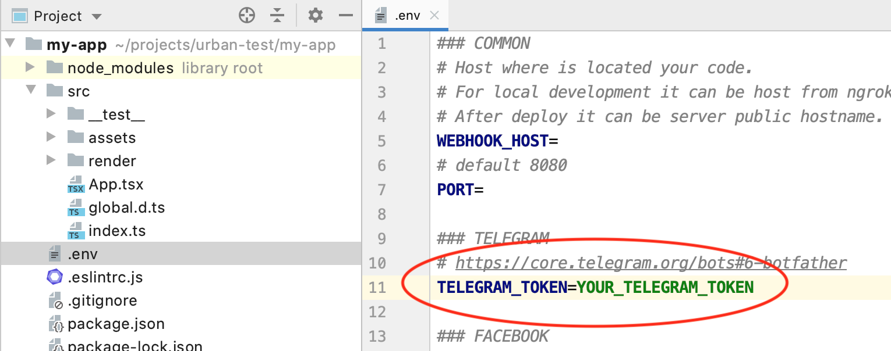
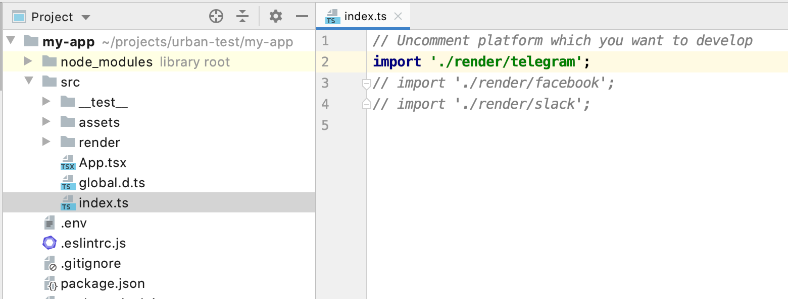

Urban Bot is a library that allows easily to develop complex chatbots on any platform. It uses <a href="https://github.com/facebook/react" target="_blanck">**React**</a> so you can use all advantages like a declarative programming, rich ecosystem, and easy reusing different parts of applications. Urban Bot uses **[components](components.md)** to send messages to users and **[hooks](hooks.md)** to subscribe to messages from users.

## Installation
The easiest way to start using Urban Bot is our starter.

Just write in your terminal.
##### For using typescript
```shell
npx create-urban-bot my-app
```
##### For using javascript
```shell
npx create-urban-bot my-app --template js
```
_(to use `npx` you need npm 5.2+ and higher, see <a href="https://gist.github.com/gaearon/4064d3c23a77c74a3614c498a8bb1c5f" target="_blank">instructions for older npm versions</a>)_

After downloading your new app will be inside `my-app` directory.

Now we need to set up specific messengers to start work with them.
## Telegram
#### Local development
1. To start work with <a href="https://telegram.org/" target="_blank">telegram</a> you have to get <a href="https://core.telegram.org/bots#6-botfather" target="_blank">telegram token</a>
from <a href="https://t.me/botfather" target="_blank">@BotFather</a>. Write to BotFather `/newbot`, write display name of your new bot, then username and you should get telegram token.


2. Then open your app which you have install via [`create-urban-bot`](#installation) and paste the telegram token to `.env`.
<details>
<summary>telegram token in .env</summary>

</details>

3. After this go to `src/index.ts` or `src/index.js` and uncomment `// import './render/telegram';`
<details>
<summary>src/index</summary>

</details>

4. Your bot is ready to launch! Run `npm run dev` and write something to your bot. It should work as default app.
